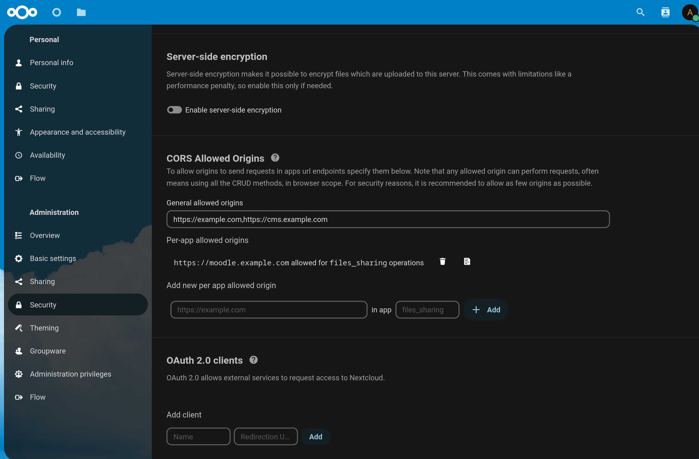

# CORS Origin Filter Settings

> :warning: **WIP Draft APP**
> 
>  By now this app is still in draft state as it needs to be discussed and planned in https://github.com/nextcloud/server/issues/37716 , or in the pull request: https://github.com/nextcloud/server/pull/37896

This app provides the possibility to manage some settings of how Cross-Origin Resource Sharing (CORS) is handled.

## Screenshot

## Description

CORS protection is meant to protect is an HTTP-header based mechanism that allows a server to indicate any origins (domain, scheme, or port) other than its own from which a browser should permit loading resources. CORS also relies on a mechanism by which browsers make a "preflight" request to the server hosting the cross-origin resource, in order to check that the server will permit the actual request. In that preflight, the browser sends headers that indicate the HTTP method and headers that will be used in the actual request.

[More information about CORS](https://developer.mozilla.org/en-US/docs/Web/HTTP/CORS)

This app will help to define the allowed general origins, that will be allowed to obtain all resources, and also the per app allowed origins; This will add granularity in defining if an origin is allowed to obtain resources from specific app such as preview, search, etc...
